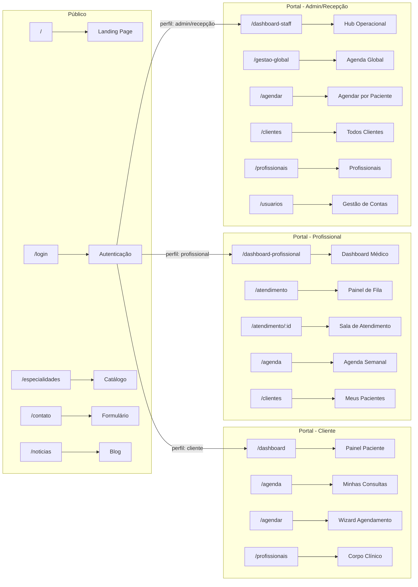

<p align="center">
  
  
  
  
  
</p>

<h1 align="center">💊 VitalHub — Portal Clínico</h1>

<p align="center">
  <strong>Interface premium para gestão completa de clínicas médicas</strong><br/>
  Glassmorphism · Dark Mode inteligente · RBAC visual · Wizard de agendamento
</p>

<p align="center">
  
  
  
  
  
</p>

---

## ⚡ Quick Start

```bash
# 1. Instalar dependências
npm install

# 2. Configurar variável de ambiente
echo "VITE_API_URL=http://localhost:3001/api" > .env

# 3. Iniciar dev server
npm run dev          # → http://localhost:5173

# 4. Build para produção
npm run build        # → dist/
```

---

## 🎨 Design System

### Filosofia Visual

| Aspecto | Implementação |
|:--------|:-------------|
| 🪟 **Glassmorphism** | Cards com `backdrop-filter: blur()` e bordas translúcidas |
| 🌗 **Dark Mode** | Toggle exclusivo do portal via `data-vitalhub-theme="dark"` |
| 🎯 **Micro-animações** | `fade-in`, `slide-up`, `pulse` em toda a interface |
| 📱 **Responsividade** | Layouts adaptáveis para desktop, tablet e mobile |
| ✍️ **Tipografia** | [Inter](https://fonts.google.com/specimen/Inter) — Google Fonts |

### Paleta de Cores

```
🟢 Primária        ──── #16a34a → #15803d (verde clínico)
⚪ Neutros Claros  ──── #f8fafc → #e2e8f0 → #94a3b8
⚫ Neutros Escuros ──── #0f172a → #1e293b → #334155
🔵 Acento          ──── #3b82f6 (ações e links)
🟡 Warning         ──── #f59e0b (aguardando/pendente)
🔴 Danger          ──── #dc2626 (cancelar/erro)
🟣 Info            ──── #8b5cf6 (concluídos/badges)
```

### Temas

O dark mode é **isolado ao portal VitalHub** — não afeta o site público (landing page). Funciona via:

```
html[data-vitalhub-theme="dark"] .vitalhub-portal { ... }
```

| Token | ☀️ Claro | 🌙 Escuro |
|:------|:---------|:---------|
| Background Primário | `#f8fafc` | `#0f172a` |
| Background Cards | `#ffffff` | `#1e293b` |
| Texto Principal | `#1a202c` | `#f1f5f9` |
| Texto Secundário | `#64748b` | `#94a3b8` |
| Bordas | `#e2e8f0` | `#334155` |

---

## 🏗️ Arquitetura do Projeto

```
src/
├── 📄 main.jsx                    # Entry point (React DOM)
├── 📄 App.jsx                     # Router + ProtectedRoute + RBAC
│
├── 🎨 styles/                     # 25 CSS modules
│   ├── App.css                    # 🎯 Design System global (37KB)
│   ├── Home.css                   # Landing page
│   ├── Login.css                  # Tela de autenticação
│   ├── Sidebar.css                # Menu lateral premium
│   ├── DashboardPaciente.css      # Portal do paciente
│   ├── DashboardProfissional.css  # Dashboard médico
│   ├── DashboardStaff.css         # Hub operacional
│   ├── GestaoGlobal.css           # Agenda global
│   ├── PainelMedico.css           # Painel de atendimento
│   ├── SalaAtendimento.css        # Sala + modal exames
│   ├── FormAgendamento.css        # Wizard multi-step
│   ├── Agenda.css                 # Agenda com stats
│   ├── Usuarios.css               # Gestão de contas
│   └── ... (12 módulos adicionais)
│
├── 📦 components/                 # 8 componentes reutilizáveis
│   ├── Header.jsx                 # Navbar do site público
│   ├── Footer.jsx                 # Rodapé institucional
│   ├── Sidebar.jsx                # Menu lateral (portal)
│   ├── FormAgendamento.jsx        # 🧙 Wizard de 4 passos
│   ├── FormCliente.jsx            # Cadastro de paciente
│   ├── AgendamentoCard.jsx        # Card de consulta
│   ├── AnalyticsCharts.jsx        # Gráficos Recharts
│   └── Loading.jsx                # Spinner premium
│
├── 📄 pages/                      # 17 telas
│   ├── Home.jsx                   # Landing page pública
│   ├── Login.jsx                  # Login dual (paciente/profissional)
│   ├── Especialidades.jsx         # Catálogo de especialidades
│   ├── Contato.jsx                # Formulário de contato
│   ├── Noticias.jsx               # Blog / novidades
│   ├── DashboardPaciente.jsx      # 🔵 Portal do paciente
│   ├── DashboardProfissional.jsx  # 🟢 Dashboard médico
│   ├── DashboardStaff.jsx         # 🟠 Hub operacional
│   ├── GestaoGlobal.jsx           # 🟠 Agenda multi-médico
│   ├── PainelMedico.jsx           # 🟢 Fila de atendimento
│   ├── SalaAtendimento.jsx        # 🟢 Prontuário + receita + exames
│   ├── Agenda.jsx                 # 📅 Agenda com stats por perfil
│   ├── Agendar.jsx                # 📅 Wrapper do wizard
│   ├── Clientes.jsx               # 👥 Pacientes (filtrado por perfil)
│   ├── Profissionais.jsx          # 🩺 Corpo clínico
│   ├── Usuarios.jsx               # 🔴 Gestão de contas (admin)
│   └── Novidades.jsx              # Changelog
│
├── 🔐 contexts/                   # React Context
│   └── AuthContext.jsx            # Login, logout, token JWT
│
├── 🪝 hooks/                      # Custom hooks
│   ├── useApi.js                  # Fetch com loading/error
│   └── useDarkMode.js             # Toggle de tema
│
├── 🌐 services/                   # Camada de API
│   └── api.js                     # Axios + interceptors JWT
│
├── 🛠️ utils/                      # Utilitários
│   └── pdfGenerator.js            # Gerador de PDF (receitas/exames)
│
└── 🖼️ assets/                     # Imagens e logos
    └── image/
        └── logo.jpg               # Logo da Clínica Vita
```

---

## 🧩 Componentes Principais

<details>
<summary>🧙 <strong>FormAgendamento</strong> — Wizard de 4 passos</summary>

O coração do sistema de agendamento. Adapta-se ao perfil:

| Passo | Cliente | Admin / Recepção |
|:------|:--------|:-----------------|
| **0** | *(pula)* | 🔍 Busca e seleção de paciente |
| **1** | Escolher Profissional | Escolher Profissional |
| **2** | Escolher Serviço | Escolher Serviço |
| **3** | Data, Hora e Modalidade | Data, Hora e Modalidade |
| **4** | Confirmação Final | Confirmação Final |

**Features:**
- ✅ Grid de horários com bloqueio visual de slots ocupados
- ✅ Label "Ocupado" e tooltip nos horários indisponíveis
- ✅ Seleção presencial / teleconsulta com cards visuais
- ✅ Legenda de cores para horários

</details>

<details>
<summary>📊 <strong>AnalyticsCharts</strong> — Gráficos de dados</summary>

Componentes `Recharts` para visualização:
- 📈 `RevenueChart` — Gráfico de receita
- 📊 `PatientsFlowChart` — Fluxo de pacientes (7 dias)

</details>

<details>
<summary>🗂️ <strong>Sidebar</strong> — Menu lateral inteligente</summary>

Menu com itens **dinâmicos por perfil**:

| Link | 🔴 Admin | 🟠 Recepção | 🟢 Prof | 🔵 Cliente |
|:-----|:--------:|:-----------:|:-------:|:----------:|
| Hub Operacional | ✅ | ✅ | ❌ | ❌ |
| Agenda Global | ✅ | ✅ | ❌ | ❌ |
| Novo Agendamento | ✅ | ✅ | ❌ | ❌ |
| Pacientes | ✅ | ✅ | ❌ | ❌ |
| Profissionais | ✅ | ✅ | ❌ | ❌ |
| Acessos & Contas | ✅ | ❌ | ❌ | ❌ |
| Início | ❌ | ❌ | ✅ | ✅ |
| Atendimento | ❌ | ❌ | ✅ | ❌ |
| Agenda Semanal | ❌ | ❌ | ✅ | ❌ |
| Meus Pacientes | ❌ | ❌ | ✅ | ❌ |
| Minhas Consultas | ❌ | ❌ | ❌ | ✅ |
| Agendar | ❌ | ❌ | ❌ | ✅ |
| Corpo Clínico | ❌ | ❌ | ❌ | ✅ |

Inclui: toggle 🌗 dark mode + perfil do usuário no footer.

</details>

<details>
<summary>🗓️ <strong>AgendamentoCard</strong> — Card de consulta</summary>

Card completo com:
- ⏰ Hora + duração em minutos
- 🏷️ Badge de status colorido (agendado, confirmado, em espera, etc)
- 📹 Link direto para teleconsulta (se aplicável)
- 🔗 Botão de editar link (apenas profissional)
- 📅 Link "Adicionar ao Google Calendar"
- ✅ Confirmar / 🔄 Reagendar / ❌ Cancelar

</details>

---

## 🛣️ Mapa de Rotas



---

## 🛡️ Sistema de Proteção de Rotas

O `ProtectedRoute` wrapper garante acesso baseado em perfil:

```jsx
<Route path="/usuarios" element={
  <ProtectedRoute perfisPermitidos={['admin']}>
    <Usuarios />
  </ProtectedRoute>
} />
```

| Rota | Perfis Permitidos |
|:-----|:-----------------|
| `/dashboard` | 🔵 Cliente |
| `/dashboard-profissional` | 🟢 Profissional, 🔴 Admin |
| `/dashboard-staff` | 🟠 Recepcionista, 🔴 Admin |
| `/atendimento` | 🟢 Profissional, 🔴 Admin |
| `/atendimento/:id` | 🟢 Profissional, 🔴 Admin |
| `/clientes` | 🔴 Admin, 🟢 Prof, 🟠 Recepção |
| `/agendar` | 🔵 Cliente, 🟠 Recepção, 🔴 Admin |
| `/gestao-global` | 🟠 Recepcionista, 🔴 Admin |
| `/usuarios` | 🔴 Admin |

---

## 🔌 Integração com API

### Configuração

```env
VITE_API_URL=http://localhost:3001/api
```

### Camada de Serviços (`services/api.js`)

```
┌──────────────┐     ┌──────────────┐     ┌──────────────┐
│  Componente  │────▶│   api.js     │────▶│  Backend     │
│  React       │◀────│  (Axios)     │◀────│  Express     │
└──────────────┘     └──────────────┘     └──────────────┘
                          │
                     Interceptors:
                     ├─ Request: Injeta Bearer token
                     └─ Response: 401 → auto-logout
```

### Funções disponíveis

| Módulo | Função | Endpoint |
|:-------|:-------|:---------|
| 🔐 Auth | `login()` | `POST /api/login` |
| 🔐 Auth | `registro()` | `POST /api/registro` |
| 🩺 Profissionais | `listarProfissionais()` | `GET /api/profissionais` |
| 🩺 Profissionais | `criarProfissional()` | `POST /api/profissionais` |
| 📦 Serviços | `listarServicos()` | `GET /api/servicos` |
| 👥 Clientes | `listarClientes()` | `GET /api/clientes` |
| 👥 Clientes | `criarCliente()` | `POST /api/clientes` |
| 📅 Agendamentos | `listarAgendamentos()` | `GET /api/agendamentos` |
| 📅 Agendamentos | `criarAgendamento()` | `POST /api/agendamentos` |
| 📅 Agendamentos | `atualizarAgendamento()` | `PUT /api/agendamentos/:id` |
| 📅 Agendamentos | `cancelarAgendamento()` | `DELETE /api/agendamentos/:id` |
| 📅 Agendamentos | `verificarDisponibilidade()` | `GET /api/agendamentos/disponibilidade` |
| 📋 Prontuários | `buscarProntuario()` | `GET /api/prontuarios/:id` |
| 📋 Prontuários | `salvarProntuario()` | `POST /api/prontuarios/:id` |
| 📋 Histórico | `buscarHistoricoSaude()` | `GET /api/clientes/meu-historico` |

---

## 📸 Telas por Perfil

### 🔵 Paciente
| Tela | Descrição |
|:-----|:----------|
| Dashboard | Próxima consulta, histórico resumido, atalhos rápidos |
| Minhas Consultas | Agenda diária/semanal com cards de agendamento |
| Agendar | Wizard 4 passos (profissional → serviço → data → confirmação) |
| Corpo Clínico | Lista de médicos com foto e especialidade |

### 🟢 Profissional (Médico)
| Tela | Descrição |
|:-----|:----------|
| Dashboard | Métricas do dia, próximos pacientes, gráficos |
| Painel de Atendimento | Fila do dia com cards de ação (confirmar, atender, prontuário) |
| Sala de Atendimento | Editor SOAP, receituário, exames, PDF, histórico do paciente |
| Agenda de Pacientes | Stats (agendados, confirmados, concluídos) + lista filtrada |
| Meus Pacientes | Apenas pacientes que já passaram pelo médico |

### 🟠 Recepcionista
| Tela | Descrição |
|:-----|:----------|
| Hub Operacional | Métricas (na clínica, receita, pendentes), agenda do dia, check-in, pagamento |
| Agenda Global | Visão por coluna de cada médico, slots do dia, encaixe rápido |
| Novo Agendamento | Wizard com passo extra: busca e seleção do paciente |
| Pacientes | Base completa de clientes com cadastro |

### 🔴 Administrador
| Tela | Descrição |
|:-----|:----------|
| *Tudo da Recepção* | Acesso total ao Hub e Agenda Global |
| Acessos & Contas | Criar recepcionistas, administradores e médicos no sistema |

---

## 🧪 Credenciais de Teste

> Senha universal: **`123456`**

| Perfil | E-mail | O que vê |
|:-------|:-------|:---------|
| 🔴 Admin | `admin@clinica.com` | Tudo — visão panorâmica |
| 🟢 Médica | `ana.silva@clinica.com` | Dashboard + Atendimento + Pacientes |
| 🟢 Médico | `roberto.santos@clinica.com` | Dashboard + Atendimento + Pacientes |
| 🔵 Paciente | `maria.santos@email.com` | Consultas + Agendar + Profissionais |
| 🟠 Recepção | `recepcao@clinica.com` | Hub + Agenda Global + Agendar |

---

<p align="center">
  <sub>Desenvolvido com 💚 para <strong>Clínica Vita</strong> — VitalHub Enterprise Platform v2.0</sub>
</p>
